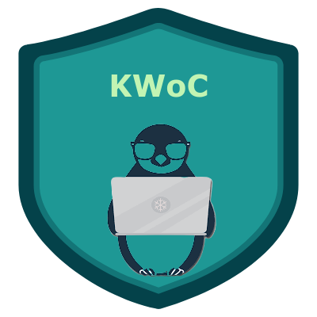
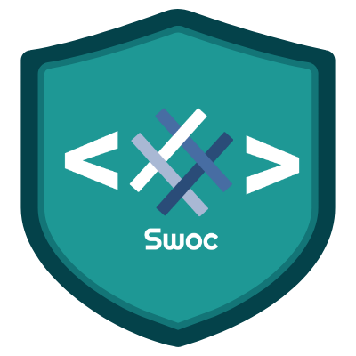
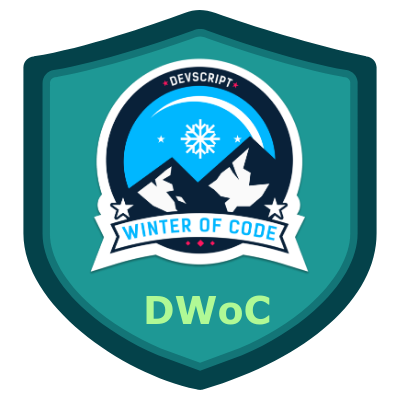

# Community-Website

  <b> HITK Tech Community 👩🏻‍💻👨🏻‍💻 </b>
  
Being from tier-2 and tier-3 colleges, you often face the problem of knowledge gap in our college days. But once you begin walking in the path of tech, you discover a place where people are just like you. 😇✨ 
We are a group of HITK students trying to fill the knowledge gap and help you find your place of discovery by sharing you the opportunities and resources at the right time!⏱️ 

This project aims to build the official site for the community page so that any student can use the resources shared by us.

## Tech Stack 🗃

      
 
## How to contribute ? 
- Follow Contributon Guidelines mentioned [here](https://github.com/HITK-TECH-Community/Community-Website/blob/main/CONTRIBUTING.md)

##  Getting Started 👨‍💻
### Setup the repository to your local environment.

1. `fork` the repository  - Creates a replica of repository to your local environment.
2. Clone the repository using `git clone https://github.com/YOUR-USERNAME/Community-Website`  - Downloads all repo files to your machine.
3. `cd Community-Website`  - Takes you to the root directory of the project.

## Frontend ⚛️

Following are the steps to run the frontend of the community-website. All the frontend code will go in the `frontend` directory. 

1. Navigate to `frontend` folder using `cd frontend`.
2. Run `npm install`. It will install all the required packages and dependencies.
3. Run `npm start` to run the server.
4. Navigate to [http://localhost:3000](http://localhost:3000) to view it in the browser.

## Backend 💻

All the backend code will go in the `backend` folder.

1. Navigate to `backend` folder using `cd backend`
2. Run `npm install`. It will install all the required packages and dependencies.
3. Run `npm run dev` to run the server in dev mode.
4. Navigate to [http://localhost:3500](http://localhost:3500) to see the backend server runing in the browser.

## Related Repositories 📂

- [HITK-TECH-Community/HITK_Tech_Community](https://github.com/HITK-TECH-Community/HITK_Tech_Community) : The repository containing all the broadcasts done by HITK-TECH-Community

## Community 👥

## Programs We have been associated with 🤍

## Contributors 🌟

Thanks goes to these wonderful people ✨✨:

