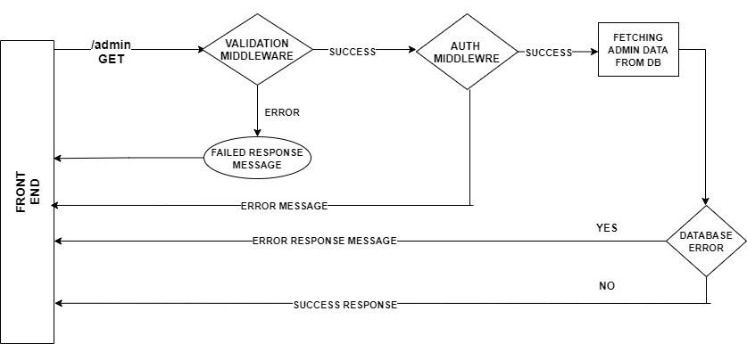
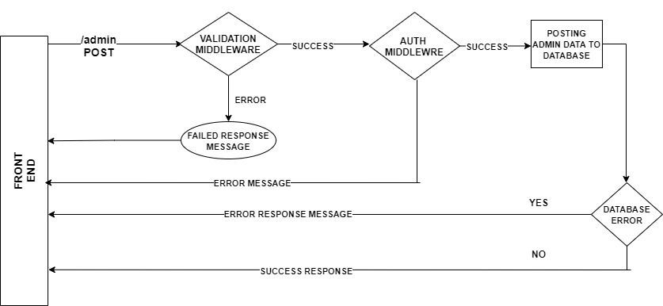
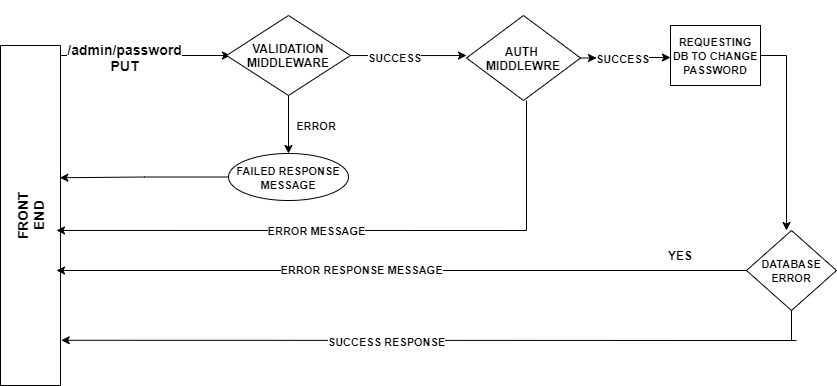

# <u>Backend Documentation</u>
 

### Admin module
The Admin module is responsible for all the functions related to admin, for example : fetching particular admin data from the database, creating a new account, changing password etc. 
Before executing every route function validation middleware gets executed which checks whether the input is in the given format or not . For this validation process a library called joi is used. 
### API description
- <code> <b> /admin </b> </code> [<b>GET</b> ]
    - GET the list of all admins
    - response body : 
        | Parameter   | description |
        | ----------- | ------------
        | firstName   | string, required |
        | lastName    | string, required |
        | username    | string, required, unique |
        | email       | string, required, unique |
        | contact     | string, required |
        | isSuperAdmin| boolean |
  
    - 
     

- <code> <b> /admin </b> </code> [ <b>POST</b> ] 
    - Create a new admin account

    - request body : 
        | Parameter   | description |
        | ----------- | ------------
        | firstName   | string, required|
        | lastName    | string, required|
        | username    | string, required, unique|
        | email       | string, required, unique|
        | contact     | string, required|

    - 
 

- <code> <b> /admin/password </b> </code> [ <b>PUT</b> ] 
    - Change the existing admin's Password
    - request body : 
        | Parameter   | desciption |
        | ----------- | -----------
        | old password| string, required|
        | new password| string, required |
           
        
    - 