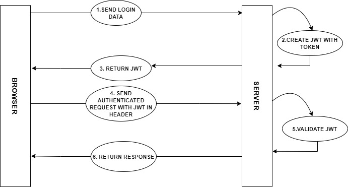
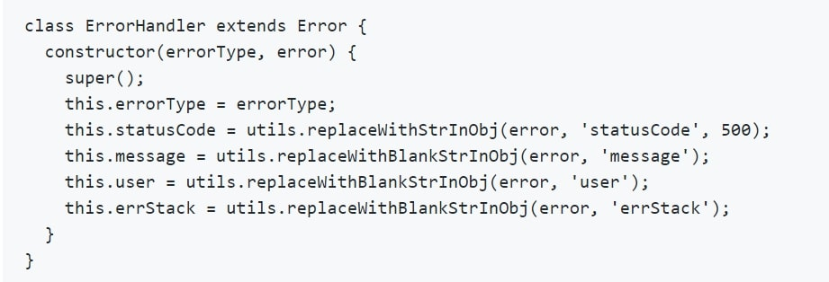

# <u>Backend Documentation</u>
 

### Auth module
This module is responsible for all the activities related to authentication.

### API description
-  <code> <b> /auth/login </b> </code> [<b>POST</b> ]
    - Login for existing users
    - request body : 
        | Parameter   | Description|
        | ----------- | -----------|
        | email       | string, required|
        | password    | string, required|

 

  - 

 

##### The auth middleware uses JWT method for verification.
 

 

JWT consists of three parts headers, payload and signature.
<b>Header</b> - This contains the type of token and the algorith used for signing.

<b>Payload</b> - This contains different types of claims like registerd, private and public claims. In our project we have passed {name, email and isSuperAdmin} all these are <b>private claims</b>.We can also pass <b>registered claims</b> like <b>iss</b> (issuer), <b>exp</b> (expiration time), <b>sub</b> (subject), <b>aud</b> (audience) etc.

<b>Signature</b> - For creating signature we need encoded header, encoded payload and a secret .
The user submits the login data which is collected by the server and using these data it generates a JSON Web Token. This token is then passed to the client side at every subsequent request made to protected route . The server validates the token, if it matches then the client gets the access otherwise error is thrown.

###### ERROR RESPONSE 
- If header is invalid or missing:
  - Staus Code: <code>401</code>

  - Content: Missing or invalid authentication header

- If token is not verified :
  - Status Code: <code>401</code>
  - Content: JWT authentication failed

  ### Custom Error class
  For throwing errors we have made our own custom <b>ErrorHandler</b> class which inherits the properties from inbuilt <b>Error</b> class 
  

  

 

- <b>errorType</b> - describes the type of error whether - it is internal server error, database error etc.
- <b>statusCode</b> -HTTP response code eg:- 400, 401, 500 etc
- <b>message</b> - used for sending the custom error messages.
- <b>User</b> - the user for which error is thrown
- <b>errStack</b> -  provides the stack trace of the error