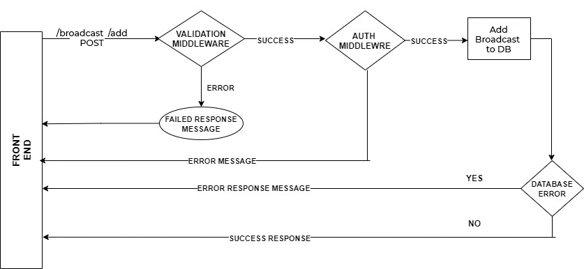

# <u>Backend Documentation</u>
 

### Broadcasts module
The Broadcasts module is responsible for all the functions related to Broadcasts, for example : fetching particular Broadcasts from the database, creating a new Broadcasts, Updating Broadcasts, Deleting Broadcasts etc. 
Before executing every route function validation middleware gets executed which checks whether the input is in the given format or not also for all the routes except get route, auth middleware gets executed which checks the validity of token in authorization header.

### API description
- <code> <b> /broadcast </b> </code> [<b>  POST</b> ]
    - Add new broadcast to the database
    - request body : 
        | Parameter   | description |
        | ----------- | ------------
        | title       | string, required |
        | content     | string, required |
        | link        | string(uri), required |
        | isExpired   | boolean, required     |
        | imageUrl    | array of string(uri), required |
        | category    | array of string, required      |
  
    - 
     

- <code> <b> /broadcast/:id </b> </code> [<b>  DELETE</b> ]
    - Delete broadcast from the database
     

- <code> <b> /broadcast?page= &tags= &year= &month=  </b> </code> [<b>  GET</b> ]
    - Get Array of 5 broadcast from the database
    - query params : 
        | Parameter   | description                         |
        | ----------- | ------------
        | page        | integer, optional                   |
        | tags        | string seperated by comma, optional |
        | year        | number, optional                    |
        | month       | number(min(1).max(12)), optional    |
    - This is a public Route (No Auth Required).
     